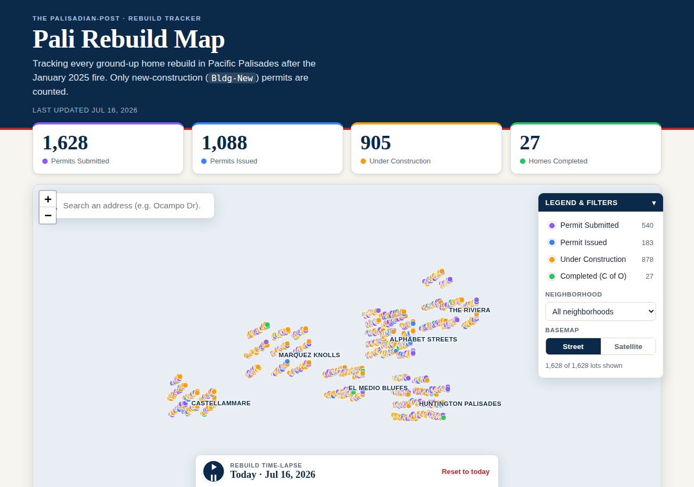

# Pali Rebuild Map

An interactive map that tracks the ground-up rebuild of **Pacific Palisades**
after the January 7, 2025 fire. Every dot is a lot with a new-construction
permit, colored by where it stands in the rebuild pipeline — from permit
submitted, to issued, to under construction, to a finished home with its
Certificate of Occupancy. Press **play** to watch the recovery unfold from the
week of the fire to today.

This is an open-source **recreation** inspired by the Palisadian-Post's
[Pali Rebuild Map](https://map.palipost.com/) (created by Palisades native
Kevin Pazirandeh). It reproduces the same rebuild funnel and interactions with a
self-contained, dependency-light static site you can host anywhere.

> **Live site:** https://pezzidouglas.github.io/PALISTRONG/
> (enable GitHub Pages for the repo — see [Deploy](#deploy))



---

## The numbers

As of the last update (mid-July 2026), the rebuild funnel is:

| Stage | Count |
|---|---:|
| 🟣 Permits **submitted** | **1,628** |
| 🔵 Permits **issued** | **1,088** |
| 🟠 **Under construction** | **905** |
| 🟢 **Completed** (Certificate of Occupancy) | **27** |

The funnel is **cumulative**: a home counted as "under construction" was also
submitted and issued. Each lot therefore sits in exactly one *current* stage,
and the per-stage totals are the differences of the funnel (540 in review,
183 issued-not-started, 878 building, 27 done).

## Methodology

Only new-construction (**`Bldg-New`**) permits are counted — the ground-up
rebuild of a home. Repair, ADU, pool, wall, and other permit types are
**excluded**, matching how the Palisadian-Post reports rebuild progress.

## Features

- 🗺️ **Interactive map** of ~1,628 rebuild lots across the burn area, rendered
  on a fast HTML canvas.
- 🎨 **Status coloring** with a clickable legend that doubles as a filter.
- ⏱️ **Rebuild time-lapse** — a play button and scrubber that replay the
  recovery from the January 2025 fire to today; the dashboard counters animate
  along with it.
- 🔎 **Address search** with live suggestions that fly to and open any lot.
- 🏘️ **Neighborhood filter** (Alphabet Streets, Huntington Palisades, El Medio
  Bluffs, Marquez Knolls, The Riviera, Castellammare).
- 🛰️ **Street / Satellite basemaps** (CARTO Voyager and Esri World Imagery — no
  API key required).
- 📍 **Per-lot popups** with permit dates and an estimated completion date.
- 📱 Fully responsive; **no build step** and **no external JavaScript CDN**
  (Leaflet is vendored into the repo).

## Status lifecycle

```
Permit Submitted ──▶ Permit Issued ──▶ Under Construction ──▶ Completed (C of O)
     🟣                    🔵                   🟠                     🟢
  #8b5cf6              #3b82f6              #f59e0b               #22c55e
```

---

## Run it locally

The app is a static site, but it `fetch()`es JSON, so it must be served over
HTTP (opening `index.html` from `file://` will not work).

```bash
# any static server works; two easy options:
npx serve .           # or:
python3 -m http.server 8080
```

Then open `http://localhost:8080`.

## Regenerate the dataset

The demo dataset is produced by a single, deterministic, dependency-free Node
script (fixed PRNG seed → identical output every run):

```bash
node scripts/generate-data.mjs
```

This writes:

- `data/homes.geojson` — a `FeatureCollection` of lots
- `data/stats.json` — funnel totals, per-neighborhood breakdown, and timeline
  bounds

Edit the `STAGE_COUNTS`, `NEIGHBORHOODS`, or date logic at the top of the script
to change the model, then re-run.

### Lot schema (`data/homes.geojson`)

Each feature is a `Point` with these properties:

| Field | Example | Notes |
|---|---|---|
| `id` | `842` | unique |
| `address` | `"1512 Ocampo Dr"` | |
| `neighborhood` | `"Huntington Palisades"` | |
| `status` | `"construction"` | `submitted` \| `issued` \| `construction` \| `completed` |
| `statusLabel` | `"Under Construction"` | display text |
| `permitType` | `"Bldg-New"` | |
| `submittedDate` | `"2025-06-14"` | ISO date or `null` |
| `issuedDate` | `"2025-09-02"` | ISO date or `null` |
| `startDate` | `"2025-11-20"` | ISO date or `null` |
| `completedDate` | `null` | ISO date or `null` |
| `estCompletionDate` | `"2027-01-08"` | projected finish |

The time-lapse derives each lot's status **as of any date** from these
milestones, so real data drops in without touching the front-end.

## Wiring in real permit data

The synthesized dataset is intentionally shaped like the real thing so you can
swap in live records. To make it authoritative:

1. Pull new-construction (`Bldg-New`) permits for the Palisades ZIP codes from a
   public source, e.g.:
   - [LA County Recovers — Permitting Progress Dashboard](https://recovery.lacounty.gov/rebuilding/permitting-progress-dashboard/)
   - [LA City Planning — Palisades Rebuild & Recovery](https://planning.lacity.gov/project-review/palisades-rebuild-recovery)
   - [CAL FIRE Damage Inspection (DINS) structure status](https://hub-calfire-forestry.hub.arcgis.com/)
2. Geocode each address to `[lon, lat]`.
3. Emit a `FeatureCollection` matching the schema above (and a `stats.json`).
4. Drop the two files into `data/`. No front-end changes required.

> ⚠️ **Disclaimer:** The lot locations, addresses, and dates committed here are
> **synthesized** to match published rebuild totals for demonstration. They are
> **not** real permit records and should not be used to make decisions about a
> specific property.

---

## Tech stack

- **[Leaflet](https://leafletjs.com/) 1.9.4** — vendored under `vendor/leaflet/`
  (BSD-2-Clause), so the page loads no third-party JavaScript.
- **Canvas rendering** for smooth interaction with thousands of markers.
- **Basemaps:** CARTO Voyager & Esri World Imagery raster tiles (keyless).
- Vanilla HTML/CSS/JS — no framework, no bundler, no `node_modules` to ship.

## Project layout

```
├── index.html              # page structure
├── css/styles.css          # editorial "Palisadian-Post" styling
├── js/app.js               # map, filters, search, time-lapse
├── data/
│   ├── homes.geojson       # generated lot dataset
│   └── stats.json          # generated funnel + timeline
├── scripts/generate-data.mjs   # reproducible dataset generator
├── vendor/leaflet/         # vendored Leaflet dist
└── .github/workflows/pages.yml # GitHub Pages deploy
```

## Deploy

Pushing to the default branch auto-deploys to GitHub Pages via
`.github/workflows/pages.yml`. One-time setup: in the repo, go to
**Settings → Pages → Build and deployment → Source: GitHub Actions**.

---

## Credits & sources

- Inspired by the Palisadian-Post's **Pali Rebuild Map** by Kevin Pazirandeh —
  <https://map.palipost.com/>.
- Rebuild figures and methodology from Palisadian-Post reporting
  ([27 homes completed](https://palipost.com/interactive-pali-rebuild-map-shows-27-new-homes-completed/),
  [rebuild dashboard](https://palipost.com/pacific-palisades-rebuild-dashboard/)).
- Basemaps © OpenStreetMap contributors, © CARTO, and © Esri / Maxar.

## License

[MIT](LICENSE) for this project's code. Vendored Leaflet is under its own
[BSD-2-Clause license](vendor/leaflet/LICENSE).
